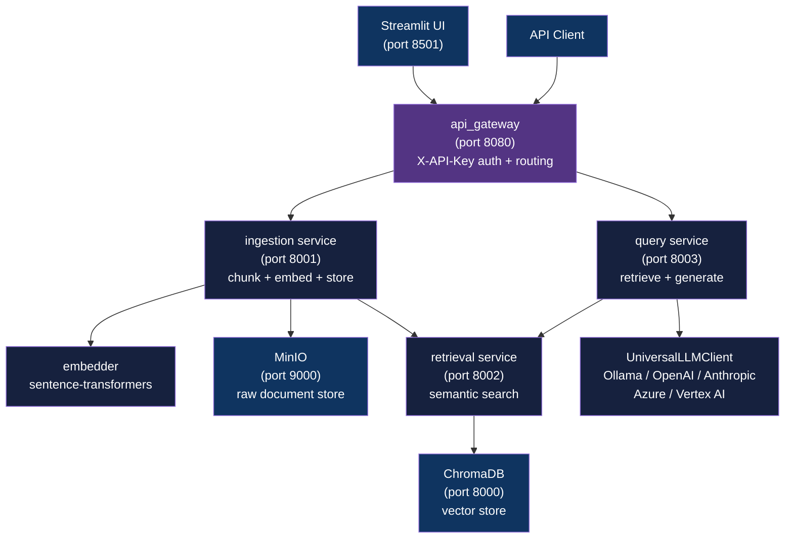

<div align="center">

# Enterprise RAG Platform

[](https://www.python.org/downloads/)
[](https://fastapi.tiangolo.com/)
[](LICENSE)

**Microservices RAG platform with multi-provider LLM, ChromaDB vectors, PII redaction, and Streamlit comparison UI**

[Getting Started](#getting-started) | [Usage](#usage) | [Architecture](#architecture)

</div>

---

## Table of Contents

- [Features](#features)
- [Tech Stack](#tech-stack)
- [Architecture](#architecture)
- [Demo](#demo)
- [Getting Started](#getting-started)
  - [Prerequisites](#prerequisites)
  - [Installation](#installation)
  - [Configuration](#configuration)
- [Usage](#usage)
- [API Reference](#api-reference)
- [Project Structure](#project-structure)
- [Deployment](#deployment)
- [Security](#security)
- [License](#license)
- [Author](#author)

## Features

- **Multi-provider LLM** - swap between Ollama (local), OpenAI, Anthropic, Azure OpenAI, and Vertex AI via a single env var
- **Document ingestion** - TXT, PDF, and DOCX support with token-aware chunking and automatic PII detection/redaction
- **Semantic search** - ChromaDB vector store with sentence-transformer embeddings; retrieval service runs as a standalone FastAPI microservice
- **API Gateway** - single entry point on port 8080 with X-API-Key auth, request routing to four backend services
- **Streamlit comparison UI** - side-by-side view of direct LLM response vs RAG-enhanced response with source citations and chunk counts
- **Structured JSON logging** - per-service log files in `logs/` for observability and security auditing
- **MinIO object storage** - S3-compatible backend for raw document storage alongside ChromaDB embeddings
- **Docker Compose** - all infrastructure services (ChromaDB, Ollama, MinIO, Redis) wired up and health-checked

## Tech Stack

| Component | Technology |
|-----------|------------|
| Language | Python 3.11+ |
| API Framework | FastAPI |
| Frontend | Streamlit |
| Vector Store | ChromaDB |
| Embeddings | Sentence Transformers |
| Local LLM | Ollama (llama3.2:3b default) |
| Cloud LLM | OpenAI, Anthropic, Azure OpenAI, Vertex AI |
| Object Storage | MinIO (S3-compatible) |
| Caching | Redis |
| Containerization | Docker Compose |

## Architecture



## Demo


*Side-by-side comparison: Direct LLM response (left) vs RAG-enhanced response (right) with source citations and chunk counts.*

## Getting Started

### Prerequisites

- Python 3.11+
- Docker and Docker Compose
- 8 GB+ RAM (16 GB recommended for local LLM via Ollama)

### Installation

1. Clone the repository:
   ```bash
   git clone https://github.com/adityonugrohoid/enterprise-rag-platform.git
   cd enterprise-rag-platform
   ```

2. Create and activate a virtual environment:
   ```bash
   python3 -m venv .venv
   source .venv/bin/activate
   ```

3. Install dependencies:
   ```bash
   pip install -r requirements.txt
   ```

4. Start infrastructure services:
   ```bash
   docker compose up -d
   ```

5. Pull the default Ollama model:
   ```bash
   docker exec -it ollama ollama pull llama3.2:3b
   ```

6. Start backend services:
   ```bash
   bash scripts/start_services.sh
   ```

7. Verify all services are healthy:
   ```bash
   curl http://localhost:8080/health
   ```

### Configuration

Copy the example env file and edit it with your settings:

```bash
cp .env.example .env
```

<details>
<summary>Full configuration reference</summary>

```bash
# Environment
ENVIRONMENT=local

# API Security
API_KEY=dev-api-key
JWT_SECRET_KEY=change-this-in-production

# LLM provider: ollama | openai | anthropic | azure | vertex
LLM_PROVIDER=ollama
LLM_MODEL=llama3.2:3b

# Service URLs (defaults match Docker Compose service names)
OLLAMA_HOST=http://ollama:11434
CHROMA_HOST=http://chroma:8000
MINIO_ENDPOINT=minio:9000
MINIO_ROOT_USER=minioadmin
MINIO_ROOT_PASSWORD=minioadmin
REDIS_HOST=redis
REDIS_PORT=6379

# Cloud LLM keys (required only for the selected provider)
OPENAI_API_KEY=your-key-here
ANTHROPIC_API_KEY=your-key-here
AZURE_OPENAI_ENDPOINT=your-endpoint
AZURE_OPENAI_KEY=your-key
```

</details>

## Usage

### Ingest a document

```bash
curl -X POST http://localhost:8080/documents/upload \
  -H "X-API-Key: dev-api-key" \
  -F "file=@data/documents/sample.txt"
```

### Query the RAG system

```bash
curl -X POST http://localhost:8080/query \
  -H "Content-Type: application/json" \
  -H "X-API-Key: dev-api-key" \
  -d '{"query": "What are the 5G RAN performance targets for call drop rate?"}'
```

### Launch Streamlit UI

```bash
bash scripts/start_ui.sh
# Access at http://localhost:8501
```

The UI supports multi-document selection from the sidebar, side-by-side dual response view, and real-time service health monitoring.

### Service management

```bash
bash scripts/stop_services.sh    # Stop all backend services
bash scripts/debug_services.sh   # Print per-service diagnostics
```

## API Reference

### Endpoints

| Method | Endpoint | Auth | Description |
|--------|----------|------|-------------|
| `GET` | `/health` | None | Health status of all services |
| `POST` | `/documents/upload` | X-API-Key | Upload and ingest a document (TXT, PDF, DOCX) |
| `POST` | `/query` | X-API-Key | RAG query - retrieve chunks and generate answer |

### POST /documents/upload

```bash
curl -X POST http://localhost:8080/documents/upload \
  -H "X-API-Key: <api-key>" \
  -F "file=@document.txt"
```

Response:

```json
{
  "success": true,
  "document_id": "f9cec860-cd17-46f4-80c3-36327a1c331c",
  "chunks_created": 4,
  "pii_detected": false
}
```

### POST /query

```bash
curl -X POST http://localhost:8080/query \
  -H "Content-Type: application/json" \
  -H "X-API-Key: <api-key>" \
  -d '{"query": "Your question here"}'
```

Response:

```json
{
  "success": true,
  "answer": "Generated answer with context from retrieved chunks...",
  "sources": ["document1.txt"],
  "chunks_used": 5
}
```

## Project Structure

```
enterprise-rag-platform/
├── services/
│   ├── api_gateway/       # Entry point: auth, routing (port 8080)
│   ├── ingestion/         # Document chunking, embedding, MinIO upload (port 8001)
│   ├── retrieval/         # ChromaDB semantic search (port 8002)
│   └── query/             # RAG orchestration: retrieve + LLM generate (port 8003)
├── shared/
│   ├── clients/
│   │   ├── universal_llm_client.py   # Multi-provider LLM (Ollama/OpenAI/Anthropic/Azure/Vertex)
│   │   ├── chroma_client.py          # ChromaDB wrapper
│   │   └── embedder.py               # Sentence-transformer embeddings
│   ├── models/
│   │   └── schemas.py                # Pydantic request/response schemas
│   └── utils/
│       ├── config.py                 # Env-driven config via Pydantic
│       ├── logging.py                # JSON structured logging
│       └── pii_detector.py           # Regex-based PII detection
├── frontend/              # Streamlit UI (port 8501)
├── scripts/
│   ├── start_services.sh  # Start all four backend services
│   ├── stop_services.sh
│   ├── debug_services.sh
│   ├── start_ui.sh
│   └── test_rag_flow.py   # End-to-end integration smoke test
├── deploy/
│   ├── aws/               # AWS deployment configs
│   └── gcp/               # GCP deployment configs
├── data/                  # Runtime data (gitignored)
│   └── documents/         # Sample telecom documents
├── docker-compose.yaml    # ChromaDB, Ollama, MinIO, Redis
└── requirements.txt
```

## Deployment

### Local (Docker Compose)

```bash
docker compose up -d
bash scripts/start_services.sh
```

### Cloud

The `deploy/` directory contains configs for AWS and GCP targets. For production:

- Set `ENVIRONMENT=production` and configure provider-specific API keys
- Replace Ollama with a cloud LLM provider (`LLM_PROVIDER=openai|anthropic|azure|vertex`)
- Set strong `API_KEY` and `JWT_SECRET_KEY` values
- Enable TLS termination at the load balancer
- Configure CORS origins in `api_gateway/main.py`

## Security

- **API key auth** - all endpoints (except `/health`) require `X-API-Key` header; key is validated against `config.API_KEY`
- **PII detection** - `pii_detector.py` runs regex checks for emails, phone numbers, SSNs, and credit card numbers before storage; `pii_detected` flag is returned per document
- **Secrets via env** - all credentials (API keys, MinIO password, JWT secret) are injected at runtime via `.env`; never committed to source

To report a vulnerability, please open an issue or contact the maintainer directly.

## License

This project is licensed under the [MIT License](LICENSE).

## Author

**Adityo Nugroho** ([@adityonugrohoid](https://github.com/adityonugrohoid))
