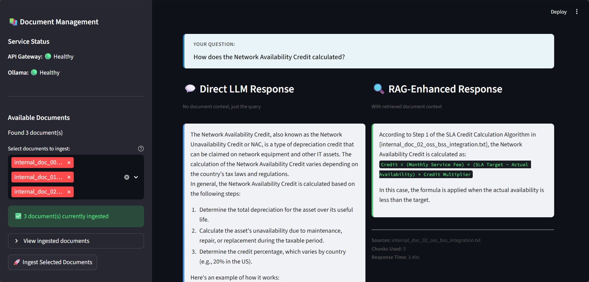

# Enterprise RAG Platform

A Retrieval-Augmented Generation (RAG) platform designed for enterprise use cases. Currently running locally with open-source models via Ollama, featuring microservices architecture, multi-provider LLM support, and comprehensive document processing capabilities.



## 🚀 Features

- **Streamlit Web UI**: Interactive ChatGPT-style interface with side-by-side comparison of Direct LLM vs RAG-enhanced responses
- **Microservices Architecture**: Scalable, independent services for ingestion, retrieval, query, and API gateway
- **Multi-Provider LLM Support**: Seamlessly switch between Ollama, OpenAI, Anthropic, Azure, and Vertex AI
- **Document Processing**: Support for TXT, PDF, and DOCX files with intelligent chunking
- **Vector Search**: ChromaDB integration for efficient semantic search
- **PII Detection**: Automatic detection and redaction of personally identifiable information
- **Token-Aware Context**: Smart context formatting to prevent LLM token overflow
- **Structured Logging**: JSON-formatted logs for better observability
- **API Key Authentication**: Secure API access with configurable keys
- **Docker Compose**: Easy local development with containerized services

## 📐 Architecture

```
┌─────────────┐
│   Client    │
└──────┬──────┘
       │
       ▼
┌─────────────────────────────────────┐
│         API Gateway (8080)           │
│  - Authentication                    │
│  - Request Routing                   │
│  - Health Checks                     │
└──────┬──────────────┬────────────────┘
       │              │
       ▼              ▼
┌─────────────┐  ┌─────────────┐
│  Ingestion  │  │    Query    │
│  Service    │  │   Service   │
│   (8001)    │  │    (8003)   │
└──────┬──────┘  └──────┬───────┘
       │                │
       ▼                ▼
┌─────────────┐  ┌─────────────┐
│  Retrieval  │  │   Ollama    │
│  Service    │  │   (11434)   │
│   (8002)    │  └─────────────┘
└──────┬──────┘
       │
       ▼
┌─────────────────────────────────────┐
│         ChromaDB (8000)              │
│      Vector Database                 │
└─────────────────────────────────────┘
```

### Services

- **API Gateway** (`services/api_gateway/`): Entry point for all API requests, handles authentication and routing
- **Ingestion Service** (`services/ingestion/`): Processes and ingests documents into the vector database
- **Retrieval Service** (`services/retrieval/`): Performs semantic search on ingested documents
- **Query Service** (`services/query/`): Orchestrates retrieval and LLM generation for RAG queries

### Infrastructure Services

- **ChromaDB**: Vector database for storing document embeddings
- **Ollama**: Local LLM server (supports OpenAI-compatible models)
- **MinIO**: S3-compatible object storage
- **Redis**: Caching layer (optional)

## 🏃 Quick Start

### Prerequisites

- Python 3.11+
- Docker and Docker Compose
- 8GB+ RAM (for local LLM models)

### Installation

1. **Clone the repository**
   ```bash
   git clone <repository-url>
   cd enterprise-rag-platform
   ```

2. **Create virtual environment**
   ```bash
   python3 -m venv .venv
   source .venv/bin/activate  # On Windows: .venv\Scripts\activate
   ```

3. **Install dependencies**
   ```bash
   pip install -r requirements.txt
   ```

4. **Start Docker services**
   ```bash
   docker compose up -d
   ```

5. **Pull Ollama model** (if using local LLM)
   ```bash
   docker exec -it ollama ollama pull llama3.2:3b
   ```

6. **Start backend services**
   ```bash
   bash scripts/start_services.sh
   ```

7. **Run health check**
   ```bash
   curl http://localhost:8080/health
   ```

## 📝 Usage

### Upload a Document

```bash
curl -X POST http://localhost:8080/documents/upload \
  -H "X-API-Key: dev-api-key" \
  -F "file=@data/documents/internal_doc_00_network_performance_standards.txt"
```

### Query the RAG System

```bash
curl -X POST http://localhost:8080/query \
  -H "Content-Type: application/json" \
  -H "X-API-Key: dev-api-key" \
  -d '{
    "query": "What are the 5G RAN performance targets for call drop rate?"
  }'
```

### Run End-to-End Tests

```bash
# Python test script
python scripts/test_rag_flow.py

# Bash test script
bash scripts/e2e_test.sh
```

### Launch Streamlit UI

For an interactive web interface with dual response comparison:

```bash
# Start the Streamlit UI
bash scripts/start_ui.sh

# Access at http://localhost:8501
```

**Streamlit UI Features:**
- 🎨 ChatGPT/Claude-style interface with centered input
- 📚 Multi-document selection and ingestion from sidebar
- 🔄 Side-by-side comparison: Direct LLM vs RAG-enhanced responses
- 📊 Real-time service health monitoring
- 📁 Interactive document management
- ⚡ Instant response time and source tracking

**Screenshot:**


*Side-by-side comparison of Direct LLM vs RAG-enhanced responses*

The UI provides a visual way to:
1. Select and ingest multiple documents at once
2. Submit queries and see dual responses side-by-side
3. Compare direct LLM output with RAG-enhanced answers
4. View sources, chunks used, and response times

## ✅ Test Results

The platform has been thoroughly tested with end-to-end integration tests. Below are the test results demonstrating successful RAG query processing:

### Test Execution Summary

```
==================================================
Enterprise RAG Platform - E2E Test
==================================================

🏥 Step 1: Checking service health...
✅ API Gateway is healthy

📄 Step 2: Testing document ingestion...
✅ Document uploaded successfully
   Document ID: f9cec860-cd17-46f4-80c3-36327a1c331c
   Chunks created: 4

⏳ Waiting 2 seconds for indexing...
```

### ✅ Query 1: Performance Targets

**Query:** `What are the 5G RAN performance targets for call drop rate?`

**Result:**
```
✅ Query processed successfully
   Query: What are the 5G RAN performance targets for call drop rate?
   Sources: ['internal_doc_00_network_performance_standards.txt']
   Chunks used: 5

   Model Response:
   ────────────────────────────────────────────────────────────
   According to [internal_doc_00_network_performance_standards.txt], the 5G RAN performance target for E2E Call Drop Rate is:
   
   - E2E Call Drop Rate: ≤0.3% (target: ≤0.1%)
   ────────────────────────────────────────────────────────────
```

**Status:** ✅ **PASSED** - Successfully retrieved and formatted performance target information from the ingested document.

---

### ✅ Query 2: Network Optimization

**Query:** `What is network optimization?`

**Result:**
```
✅ Query passed: 'What is network optimization?...'

   Query: What is network optimization?
   Model Response:
   ────────────────────────────────────────────────────────────
   According to the provided context documents, [internal_doc_00_network_performance_standards.txt], Network Optimization refers to a methodology used for optimizing the performance of RAN (Radio Access Network) deployments.
   
   The optimization process involves four phases:
   
   1. **Network Planning & Coverage**: This phase includes baseline drive tests, coverage analysis and heatmap generation, antenna optimization, and cell assignment review.
   2. **Parameter Optimization**: This phase focuses on handover tuning, cell selection adjustment, power control and interference management, and load balancing configuration.
   3. **Load Balancing & Capacity**: This phase involves traffic pattern analysis, load balancing configuration, cell congestion management, and capacity allocation.
   4. **Validation & Monitoring**: This phase includes post-optimization drive tests, daily KPI dashboard monitoring, customer complaint analysis, and automated alert configuration.
   
   The optimization process aims to improve network performance by adjusting various parameters, such as antenna tilt, transmit power, handover offsets, and load balancing thresholds, to achieve specific targets for accessibility, retainability, mobility, throughput, latency, and coverage.
   ────────────────────────────────────────────────────────────
```

**Status:** ✅ **PASSED** - Successfully provided comprehensive explanation of network optimization methodology with detailed phase breakdown.

---

### ✅ Query 3: Troubleshooting

**Query:** `How do I troubleshoot high call drop rates?`

**Result:**
```
✅ Query passed: 'How do I troubleshoot high call drop rates?...'

   Query: How do I troubleshoot high call drop rates?
   Model Response:
   ────────────────────────────────────────────────────────────
   Based on the provided context documents, it appears that high call drop rates are classified as a Priority 3 (Medium) incident in Section 6.2 Incident Classification.
   
   To troubleshoot high call drop rates, you can follow these steps:
   
   1. **Identify affected area**: Check if there are any common failures or issues affecting multiple cells or regions.
   2. **Check parameter mismatch**: Verify that all parameters, such as power control and antenna settings, are synchronized across cells.
   3. **Analyze drive test results**: Review drive test data to identify areas with poor coverage or high interference levels.
   4. **Monitor KPIs**: Check daily KPI dashboard monitoring for any unusual trends or spikes in call drop rates.
   
   If the issue persists after these initial steps, it may be necessary to escalate to a higher level of support, such as Level 2 (Senior Engineer) or Level 3 (Manager), depending on the severity and impact of the incident.
   
   It's also worth noting that Section 7.1 Change Control Board (CCB) mentions that optimization changes must include risk assessment and rollback plans. If you've recently made changes to your network, it may be worth reviewing these plans to ensure that they're adequate for addressing high call drop rates.
   
   If none of these steps resolve the issue, further investigation and analysis may be necessary to identify the root cause of the problem.
   ────────────────────────────────────────────────────────────
```

**Status:** ✅ **PASSED** - Successfully provided actionable troubleshooting steps with proper context from the documentation.

---

### Test Summary

```
==================================================
✅ All E2E tests passed!
==================================================
```

**All 3 queries passed successfully**, demonstrating:
- ✅ Document ingestion and chunking
- ✅ Semantic search and retrieval
- ✅ LLM-based answer generation
- ✅ Source citation
- ✅ Multi-query handling

## 🔧 Configuration

### Environment Variables

Create a `.env` file in the project root:

```env
# Environment
ENVIRONMENT=local

# API Security
API_KEY=dev-api-key
JWT_SECRET_KEY=change-this-in-production

# LLM Configuration
LLM_PROVIDER=ollama  # Options: ollama, openai, anthropic, azure, vertex
LLM_MODEL=llama3.2:3b

# Service URLs
OLLAMA_HOST=http://ollama:11434
CHROMA_HOST=http://chroma:8000
MINIO_ENDPOINT=minio:9000
MINIO_ROOT_USER=minioadmin
MINIO_ROOT_PASSWORD=minioadmin
REDIS_HOST=redis
REDIS_PORT=6379

# External API Keys (if using cloud LLMs)
OPENAI_API_KEY=your-key-here
ANTHROPIC_API_KEY=your-key-here
AZURE_OPENAI_ENDPOINT=your-endpoint
AZURE_OPENAI_KEY=your-key
```

### Multi-Provider LLM Setup

The platform supports multiple LLM providers:

- **Ollama** (Local): Default, no API key needed
- **OpenAI**: Set `LLM_PROVIDER=openai` and `OPENAI_API_KEY`
- **Anthropic**: Set `LLM_PROVIDER=anthropic` and `ANTHROPIC_API_KEY`
- **Azure OpenAI**: Set `LLM_PROVIDER=azure` and Azure credentials
- **Vertex AI**: Set `LLM_PROVIDER=vertex` and GCP credentials

## 📚 API Documentation

### Health Check

```bash
GET /health
```

Returns the health status of all services.

### Upload Document

```bash
POST /documents/upload
Headers:
  X-API-Key: <your-api-key>
Body:
  file: <multipart/form-data>
```

Uploads and processes a document (TXT, PDF, or DOCX).

**Response:**
```json
{
  "success": true,
  "document_id": "uuid",
  "chunks_created": 4,
  "pii_detected": false
}
```

### Query

```bash
POST /query
Headers:
  X-API-Key: <your-api-key>
  Content-Type: application/json
Body:
{
  "query": "Your question here"
}
```

Performs a RAG query and returns an answer with sources.

**Response:**
```json
{
  "success": true,
  "answer": "Generated answer...",
  "sources": ["document1.txt", "document2.txt"],
  "chunks_used": 5
}
```

## 🛠️ Development

### Project Structure

```
enterprise-rag-platform/
├── services/              # Microservices
│   ├── api_gateway/      # API Gateway service
│   ├── ingestion/         # Document ingestion service
│   ├── retrieval/         # Vector search service
│   └── query/             # RAG query service
├── shared/                # Shared utilities
│   ├── clients/           # LLM, ChromaDB, Embedder clients
│   ├── models/            # Pydantic schemas
│   └── utils/             # Logging, config, PII detection
├── scripts/               # Utility scripts
│   ├── start_services.sh  # Start all services
│   ├── stop_services.sh   # Stop all services
│   ├── test_rag_flow.py   # E2E test script
│   └── e2e_test.sh        # Bash E2E test
├── data/                  # Data directories
│   └── documents/         # Sample documents
├── docker-compose.yaml    # Docker services
└── requirements.txt       # Python dependencies
```

### Running Services

**Start all services:**
```bash
bash scripts/start_services.sh
```

**Stop all services:**
```bash
bash scripts/stop_services.sh
```

**Check service status:**
```bash
bash scripts/debug_services.sh
```

### Running Tests

```bash
# Python E2E test
python scripts/test_rag_flow.py

# Bash E2E test
bash scripts/e2e_test.sh

# Unit tests (when available)
pytest tests/
```

### Logs

Service logs are stored in `logs/`:
- `logs/ingestion.log`
- `logs/retrieval.log`
- `logs/query.log`
- `logs/api_gateway.log`

View logs:
```bash
tail -f logs/api_gateway.log
```

## 🔒 Security

- **API Key Authentication**: All endpoints require a valid API key
- **PII Detection**: Automatic detection and redaction of sensitive information
- **Data Classification**: Support for public, internal, confidential, and restricted data
- **Structured Logging**: JSON logs for security auditing

## 🚢 Deployment

### Local Development

1. Start Docker services: `docker compose up -d`
2. Start backend services: `bash scripts/start_services.sh`
3. Run tests: `python scripts/test_rag_flow.py`

### Production Considerations

- Use environment-specific configuration
- Set strong API keys and JWT secrets
- Enable HTTPS/TLS
- Configure proper CORS policies
- Set up monitoring and alerting
- Use production-grade LLM providers
- Implement rate limiting
- Set up backup and recovery procedures

## 📖 Documentation

- [Master Implementation Guide](MASTER_IMPLEMENTATION_GUIDE.md) - Complete setup and execution guide
- [Setup & Installation](docs/SETUP_INSTALLATION.md) - Detailed installation instructions
- [Telecom Synthetic Documents](docs/TELECOM_SYNTHETIC_DOCUMENTS.md) - Sample document specifications

## 🤝 Contributing

1. Fork the repository
2. Create a feature branch (`git checkout -b feature/amazing-feature`)
3. Commit your changes (`git commit -m 'Add amazing feature'`)
4. Push to the branch (`git push origin feature/amazing-feature`)
5. Open a Pull Request

## 📄 License

[Add your license here]

## 🙏 Acknowledgments

- ChromaDB for vector database capabilities
- Ollama for local LLM support
- FastAPI for the excellent web framework
- Sentence Transformers for embeddings

## 👤 Author

**Adityo Nugroho**  
- Portfolio: https://adityonugrohoid.github.io  
- GitHub: https://github.com/adityonugrohoid  
- LinkedIn: https://www.linkedin.com/in/adityonugrohoid/
